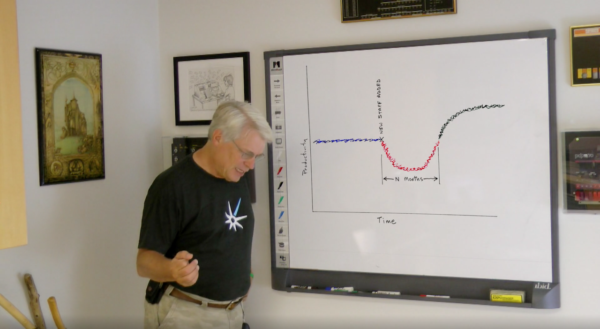
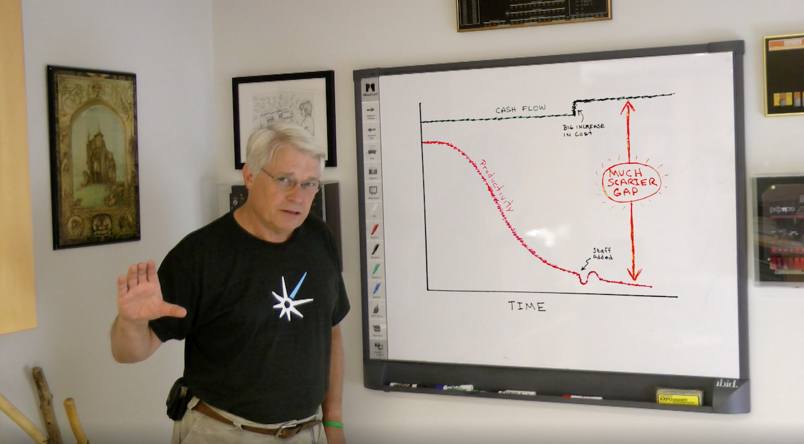
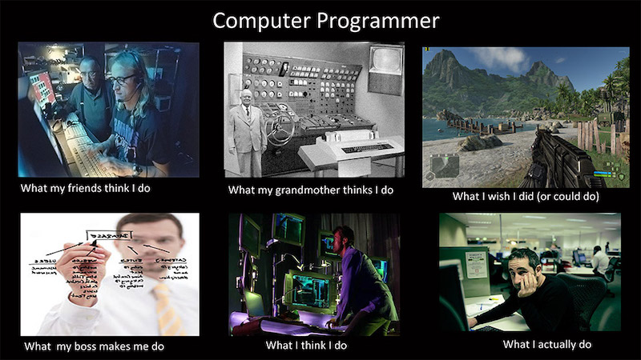
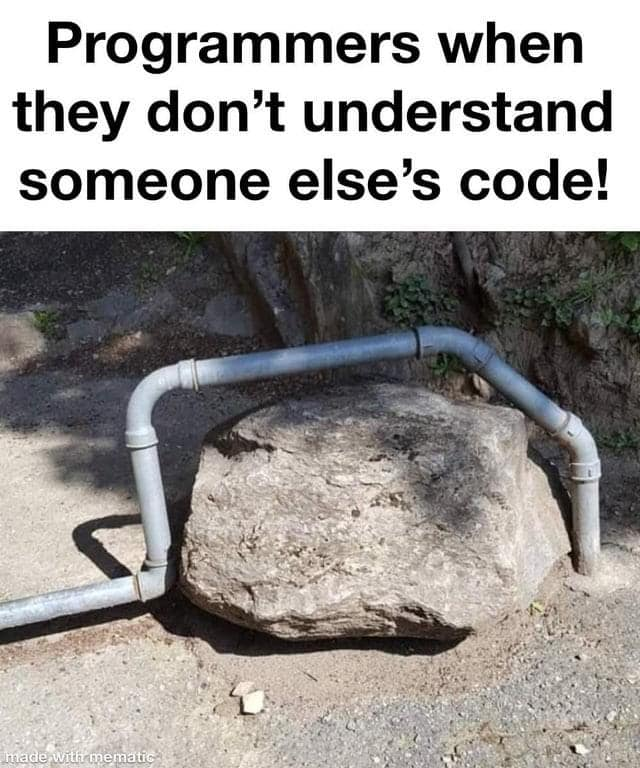

*Bài viết sử dụng tư tưởng của Uncle Bob trong [chuỗi video](https://www.oreilly.com/library/view/clean-code/9780134661742) về Clean Code*

## Use case

### Bước đầu thành lập team

Hãy tưởng tượng bạn là một lập trình viên tài năng, đã có vài năm kinh nghiệm. Công ty của bạn quyết định xây dựng một sản phẩm phức tạp, nhưng vô cùng thú vị, và cũng tương đối challenge, được kì vọng sẽ đem đến thành công xuất sắc cho công ty trong tương lai. Team gồm 5 engineer tốt nhất trong công ty, trong đó có bạn, được chọn ra để xây dựng sản phẩm này.

Thật tuyệt khi được làm việc ở một dự án mới hoàn toàn. Mọi thứ sẽ được làm mới từ đầu. Star Team (gọi tắt của team 5 người được chọn) sẽ có thể áp dụng những công nghệ mới nhất, hot nhất hiện tại để áp dụng vào dự án mới này. Họ thử nghiệm, rồi chọn ra được một stack họ cho là tốt là hợp lý nhất với công ty: hiệu năng nhanh, tốc độ phát triển nhanh chóng, nhiều tài liệu có sẵn, cộng đồng hỗ trợ tốt. Và. Bùm. Năng suất làm việc của Star Team cực cao.

Đó là sáng thứ hai đầu tuần, sau khi kick off meeting về kế hoạch phát triển sản phẩm. Tính năng đầu tiên Star Team sẽ làm đó là tính năng Authentication. Bình thường một tính năng như này team sẽ cần mất từ 3 đến 4 ngày để có thể hoàn thiện. Nhưng, Star Team, đã deliver tính năng này ngay... 4 giờ chiều hôm đó. PM không tin. CTO không tin. CEO không tin. Và chính các thành viên của Star Team cũng không tin vào chuyện đó. Làm sao chuyện đó có thể là sự thật được? Nhưng rất tiếc nó lại là sự thật. Với một stack cực tốt đã được các gã công nghệ khổng lồ như Google, Facebook sử dụng và chống lưng. Cộng với việc được implement bởi một team ngựa giống. Năng suất việc bây giờ còn nhanh hơn cả tốc độ lật bánh tráng Đà Lạt.

Một tháng sau đó, việc này vẫn tiếp tục tiếp diễn và chưa có dấu hiệu sẽ dừng lại. Các feature cứ nối đuôi nhau được release. Feature lâu nhất chỉ mất có hai ngày là hoàn thành. Chức năng chính của sản phẩm đã có thể hoạt động tương đối tốt để đem đi chào hàng, thậm chí nhiều khách hàng đã mạnh tay chi tiền mua sản phẩm để, sẵn sàng sử dụng sản phẩm khi còn đang ở bản alpha.

Mọi chuyện diễn ra rất êm đẹp. Engineer rất hạnh phúc vì năng suất làm việc của họ lên tận mây xanh. Đội ngũ quản lý sung sướng vì ngày càng nhiều khách hàng mua sản phẩm. Các hợp đồng về ngày càng nhiều, các yêu cầu về việc thêm các feature cũng tăng thêm, họ cũng feedback về các feature cũ để phù hợp với nhu cầu hơn. Tiền về, quản lý, engineer đều được tăng lương, thưởng. Với các feature request và feature feedback với tốc độ phát triển hiện tại như tên lửa thế này, team không lo thiếu việc, sản phẩm sẽ ngày càng hoàn thiện hơn và lại có nhiều khách hàng hơn. Một tương lai sáng lạn mở ra trước mắt toàn bộ Star Team và ban quản lý công ty. Star Team ngày càng làm việc chăm chỉ, rất chịu khó update và học hỏi, áp dụng những cái mới vào project. Manager thì đã họp và lên một Business Plan cực kì chi tiết cho 6 tháng tới với một sự tự tin cực kì lớn.

### Nhưng, có vẻ như có cái gì đó không đúng ở đây. Nhưng chưa ai phát hiện ra cả

Sang tháng thứ hai, mọi chuyện đã ổn định hơn. Tốc độ phát triển cũng không còn "crazy" như tháng đầu tiên nữa. Trung bình Star Team ship một tính năng mới trong thời gian từ 2 đến 3 ngày. Dù không nhanh như tháng đầu tiên, nhưng đó vẫn là một tốc độ siêu nhanh. Họ vẫn có những khách hàng mới mua sản phẩm trong tháng này.

Sang tháng thứ ba, với lượng khách hàng B2B (khách hàng là Business) và B2C (khách hàng là người dùng đơn lẻ) tăng lên nhiều, các feedback về các tính năng đã xây dựng, feature request từ người dùng tăng lên đột biến. Cộng với các tính năng trong roadmap có sẵn từ trước, Star Team có rất nhiều việc phải làm. Tốc độ ship tính năng trung bình khoảng 4 ngày. Mọi chuyện vẫn tươi đẹp với cả Star Team và đội ngủ quản lý trong tháng này. Họ có họp với nhau tại sao thời gian ship một tính năng lại lâu hơn so với những tháng trước. Và họ đứa ra vài lý do:
- Vì các tính năng ban đầu tương đối đơn giản, phần lớn là MVP (Minimum viable product), nên phát triển khá nhanh
- Hệ thống đã có khung sườn, nên ghép các tính năng mới vào mất thời gian hơn là chỉ ghép vào một trang trắng. Đây cũng là lẽ dĩ nhiên, không có gì đáng ngại cả
- Các tính năng khách hàng yêu cầu, bug fix ở thời điểm này khó hơn thời gian đầu, nên làm lâu hơn là lẽ dĩ nhiên
- Lúc đầu vì muốn đưa sản phẩm ra nhanh nhất có thể, tránh đối thủ hốt mất khách hàng, nên Star Team đã tình nguyện OT rất nhiều  nên việc code nhanh là dễ hiểu. Bây giờ khi đã có một tập khách hàng sẵn sàng trả tiền, nên nọ không cần phải như thế nữa.

Những lý do trên, tựu chung lại, đều là những nguyên nhân khách quan, mà một sản phẩm khi lớn dần lên sẽ phải gặp. Cả team đều đồng ý là không có vấn đề gì cả.

### Bước ngoặt

Nhưng bước ngoặt của câu chuyện lại nằm ở tháng thứ bảy. Khi Star Team deliver feature X mất đến 2 tuần, trong khi ở trong roadmap của Manager Team, chỉ là một tuần. Manager Team đã thất hứa với một khách hàng B2B, khiến họ hủy hợp đồng. Star Team và Manager Team có buổi họp với nhau về vấn đề năng suất làm việc không được như kì vọng, không còn nhanh như tháng đầu tiên. Nhưng Star Team chỉ giải thích là hệ thống phức tạp hơn nên cần nhiều thời gian để tích hợp tính năng mới vào.

Những tháng sau đấy, chuyện tương tự cũng xảy ra một vài lần. Thời gian trong Business Plan và thời gian phát triển thực tế chênh nhau một khoảng lớn dần. Đó là Scary Gap.

Đến tháng thứ 9, thời gian develop feature vẫn tiếp tục tăng. Star Team họp với Manager Team để tìm ra giải pháp. Và họ quyết định một phương án, đó là: thuê thêm engineer.

Tháng thứ 10, 5 bạn engineer mới được tuyển chọn khắt khe gia nhập team, đem đến một hi vọng lớn lao năng suất làm việc sẽ tăng gấp đôi. Tuy nhiên, trong tháng thứ 10, năng suất làm việc lại có chút... giảm. Nhưng điều đó là dễ hiểu, vì Star Team mất khá nhiều thời gian để phỏng vấn các ứng viên. Và sau khi các bạn mới vào làm việc, các bạn cần thời gian để onboard, và chính các thành viên hiện tại của Star Team là những người hướng dẫn các bạn mới. 

Tháng thứ 11, các bạn mới đã quen với code base structure, convention, năng suất làm việc của cả team đã trở lại như tháng thứ 9.

Đến tháng 12, năng suất làm việc cũng đã tăng lên. Tháng thứ 13, 14 năng suất làm việc... vẫn như tháng thứ 12. Manager Team không hiểu tại sao. Đáng ra năng suất làm việc phải tăng gấp đôi chứ (10 = 5x2). Chỉ duy có engineer team hiểu, vì họ biết rằng có một định lý

<blockquote>
		
Một việc một engineer làm trong 1 ngày thì hai engineer sẽ làm trong hai ngày 😂😂

		<footer>
			<cite>—Ai đó trên mạng</cite>
		</footer>
</blockquote>

Manager Team dần chấp nhận với việc engineer team đông gấp đôi nhưng năng suất làm việc chỉ tăng gấp 1.3 lần. Dĩ nhiên, họ không vui vì quỹ lương phình to ra nhưng kì vọng lại không đạt được. Họ tiếp tục thuê thêm 5 kỹ sư nữa nhưng năng suất làm việc ngay sau khi thuê thêm nhân công lại giảm và tăng dần sau 1 tháng, nhưng cũng chỉ đạt đỉnh điểm 1.8 lần so với ban đầu (kì vọng 15 người sẽ tăng năng suất 3 lần)

Tháng thứ 15, toàn bộ công ty chuyển sang phát triển duy nhất sản phẩm này.

...

Vậy là đã 1.5 năm từ khi công ty bắt đầu quyết định xây dựng sản phẩm. Hệ thống đã khá phức tạp và lớn, năng suất làm việc thì ngày càng giảm. Một buổi họp đã được diễn ra để giải quyết vấn đề này. Việc thuê thêm nhân công có vẻ không khả thi vì tính không hiệu quả của nó được chứng minh trong quá khứ. Và sau một buổi chiều brainstorm, cả engineer team đã đi đến một giải pháp chung, đó là: 

### **ĐẬP ĐI XÂY LẠI**

Manager Team rất không vui, nhưng họ không còn lựa chọn nào khác khi giữ nguyên hệ thống hiện tại với năng suất làm việc thảm hại. Thực sự thì engineer team không lười. Họ chăm, họ rất chăm ở đằng khác. Nhưng một hệ thống đã quá lớn, quá nhiều những logic đặc biệt để chiều lòng khách hàng không ai dám xóa, những tính năng làm vội để chạy deadline dính đầy technical debt với lời hứa hẹn: "sẽ sửa sau"/ "khi nào rảnh thì sửa", một kiến trúc đồ sộ đã cũ kĩ, khiến cho engineer dù làm việc 8 - 10 tiếng một ngày cũng không thể ship/ release feature nhanh được.

Business Plan thì vẫn phải tiếp tục, Manager Team không thể bảo khách hàng chờ vài tháng nữa chúng tôi sẽ có một hệ thống hoàn toàn mới, tốt hơn, nhanh hơn cho bạn sử dụng (thực ra khách hàng họ cũng chả quan tâm hệ thống mới làm gì, miễn họ có sản phẩm dùng được là được). Việc add feature, fix bug vẫn phải diễn ra trên hệ thống cũ. Và việc xây dựng hệ thống mới, được approve, nhưng chỉ với 5 thành viên nguyên thủy của Star Team đảm nhận, vì họ có kinh nghiệm nhất, hãy gọi họ là Tiger Team. 10 người còn lại vẫn tiếp tục làm việc ở code base cũ, với một sự thèm thuồng nhất định.

Tiger Team tìm ra được một stack mới, tốt hơn stack hiện tại về mọi mặt. Họ bắt đầu implement hệ thống mới. Năng suất làm việc lại cực kì nhanh như xưa. Nhưng một vấn đề hiện hữu đó là: "Requirement là gì?". Chẳng có một cái tài liệu nào cụ thể về tất cả các requirement đang có ở hệ thống hiện tại cả. Nó lắt nhắt, rải rác ở ticket, ở các đoạn chat public, private trên Skype, Slack giữa PM và engineer. Thậm chí nó còn ở ... mồm PM sang tai của engineer. Tại thời điểm phát triển, có engineer, PM và trời biết tính năng đó là gì. Bây giờ thì chỉ có trời mới biết chính xác requirement là gì. Vậy, chỉ còn một chỗ duy nhất, đó chính là code base cũ. Tiger Team lục lại old code base để đọc lại các logic cũ, đôi khi là cop nguyên logic một hàm dài 2 trang sang, chỉ đổi lại ngôn ngữ lập trình thể hiện. 

Nhưng câu chuyện không dừng lại ở đó. Vì bug fix và new feature được thêm vào liên tục bên hệ thống cũ, nên hệ thống mới cũng cần có những thứ đấy. Bây giờ, một cuộc chạy đua mới thực sự bắt đầu.

Và cuộc đua đó diễn ra tới tận 2 năm trời. Ngày release phiên bản mới, shut down phiên bản cũ, cả công ty tập trung tại nhà sếp tổng, mở tiệc ăn mừng, quyết tâm nhậu không say không về, kể cả say cũng không thể về được. Và rồi 2h sáng, các cuộc gọi từ bên Customer Support liên tục đến với cả team vì những trục trặc lớn mà khách hàng phàn nàn khi họ chuyển sang hệ thống mới. Các lập trình viên ma men thở vẫn còn ra đầy hơi rượu đành hot fix, patch ngay lỗi, tìm ngay ra logic ở bên hệ thống cũ họ sót chưa bê qua hệ thống mới. Họ deploy ngay lúc 3h sáng, rồi lại chìm vào cơn mộng mị lúc nào không hay...

Liên tục những ngày sau đó, việc tương tự xảy ra. Manager Team đã quyết định dựng lại hệ thống cũ và sẽ duy trì đồng thời cả 2 phiên bản thêm một thời gian nữa, và khách hàng sẽ có quyền lựa chọn phiên bản cũ hoặc mới để sử dụng. Phiên bản mới được khuyến nghị, thậm chí còn được tặng ưu đãi để sử dụng phiên bản mới. Một loạt các engineer mới được thuê thêm để phát triển cả hai phiên bản cùng lúc. 

Sau đó 4 tháng, hệ thống mới cũng bắt đầu phình to ra, năng suất làm việc giảm dần, một vòng lặp xuất hiện.

8 tháng sau đó công ty đóng cửa!

### Thảo luận
Độc giả có thấy câu chuyện này quen không? Tôi tin chắc ít nhiều nếu làm đủ lâu trong ngành công nghệ bạn sẽ thấy đâu đó có những công ty gặp những vấn đề như thế này, sau đó đưa ra những giải pháp na ná như thế này, và cũng gặp những khó khăn na ná thế này về mặt tài chính, nhân sự, năng suất làm việc, sau cùng thậm chí phải đóng cửa.

Vậy tóm lại, nguyên nhân thất bại của công ty trên đó là gì?

Đó là code xấu. Việc code xấu đã dẫn đến hệ thống quá cồng kềnh, phức tạp, không realiable. Động chỗ này hỏng chỗ kia, không ai dám sửa. Nhìn một đoạn code rõ ràng không dùng nữa rồi, nhưng lần đầu xóa đi, app chết, khách hàng kêu oai oái. Lần hai xóa đi, logic chạy sai, khác hàng chửi, manager kêu oai oái. Lần thứ ba, à không có lần thứ ba nữa. Vì lần thứ ba engineer đã quá sợ để xóa đi một đoạn code *"có vẻ như không dùng đến rồi"*. Họ luôn tìm cách tránh phải động vào những đoạn code khó hiểu, những đoạn code thừa. Tựa như việc bạn order đồ ăn về nhà, ăn xong rồi nhưng không dám vứt vỏ đi. Kết cục là nhà bạn toàn rác và bạn không thể bước chân ra khỏi nhà được nữa. Và thay vì sửa code xấu, team sợ hãi code xấu, và hi vọng code xấu sẽ hết khi xây dựng một hệ thống hoàn toàn mới. Nhưng thực chất, team vẫn copy rất nhiều logic cũ, đã "bẩn" từ hệ thống cũ sang hệ thống mới. Và việc năng suất làm việc tăng cao khi bắt đầu một hệ thống mới khiến chúng ta có một ảo tưởng đó là "đập đi xây lại" sẽ giải quyết được mọi vấn đề.

Việc đánh đổi chất lượng phần mềm, chấp nhận nợ kỹ thuật (Technical Debt) để đổi lấy thời gian release sản phẩm nhanh hơn cũng đóng một vai trò quan trọng trong sự thất bại của công ty trên.

### Vậy giải pháp ở đây là gì?

> *You cannot deal with a mess by running from it. The only way to effectively deal with that mess is to turn around and face it, and find the rot and clean it*

Chạy trốn khỏi code bẩn không phải là cách làm đúng đắn. Có nợ thì phải trả, hãy sống đẹp như những con thiên nga của Tchaikovsky. Nợ kỹ thuật tương tự như nợ ngân hàng. Nợ ngân hàng nếu cứ chần chừ không trả, sớm muộn cũng bị lấy nhà. Nợ kỹ thuật không trả, sớm muộn cũng bị lấy mất công ty.

### Kết luận
Tóm lại, việc code clean ở trong môi trường công nghiệp là rất quan trọng. Nhưng nó cũng khá khó, nhất là với tốc độ phát triển phần mềm siêu nhanh như hiện nay. Sự khác biệt trong tư duy của đội ngũ kỹ sư phần mềm và đội ngũ quản lý sản phẩm cũng là một rào cản lớn khiến cho việc triển khai clean code khó khăn hơn. Mỗi kỹ sư không những cần trang bị cho mình những kỹ năng lập trình tốt, mà còn cần trang bị cho mình những kỹ năng lập trình sạch. Còn những nhà quản lý công nghệ cũng nên trang bị cho mình kiến thức về các công nghệ đang sử dụng, nhận thức về tầm quan trọng của một hệ thống sạch, để ngoài phát triển tính năng nhiều và nhanh còn cải thiện chất lượng sản phẩm qua thời gian nữa. Một tính năng được phát triển nhanh không có nghĩa là chất lượng tốt và tương lai tính năng đó sẽ không "hành" mình nữa.

Cảm ơn các bạn đã đọc. Hãy đón chờ các bài tiếp theo trong chuỗi bài viết về Clean Code nhé.

Tham khảo:
- <https://www.oreilly.com/library/view/clean-code/9780134661742>