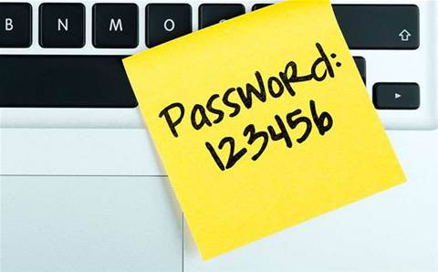
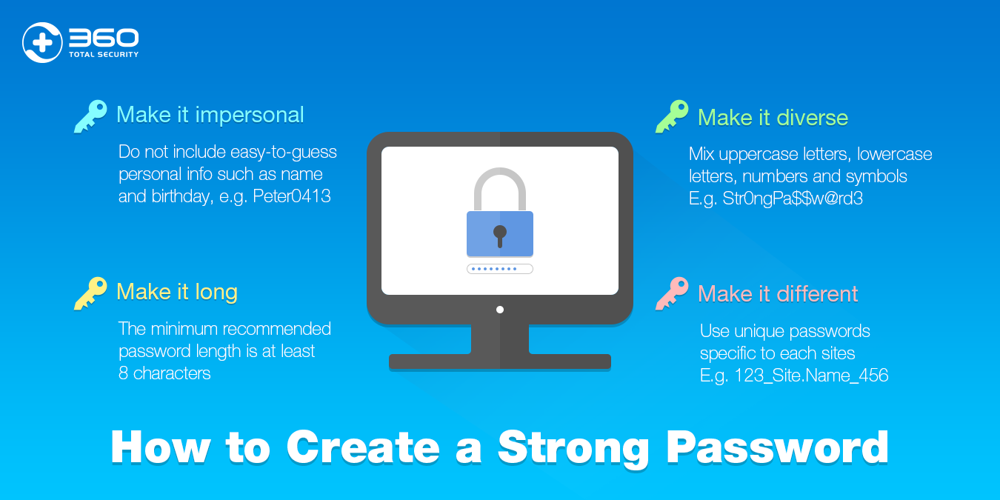
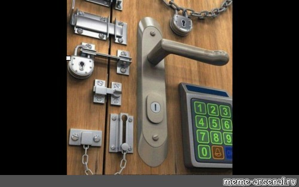
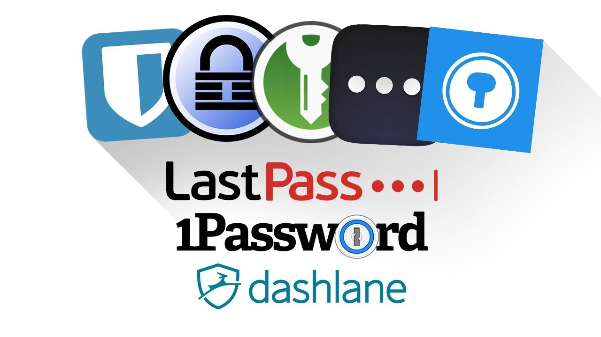
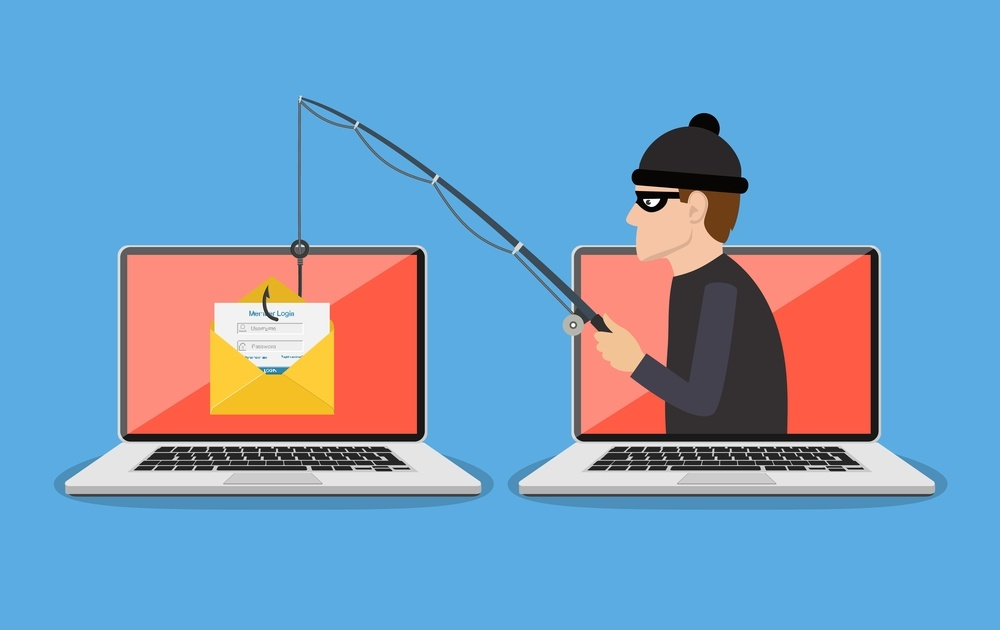
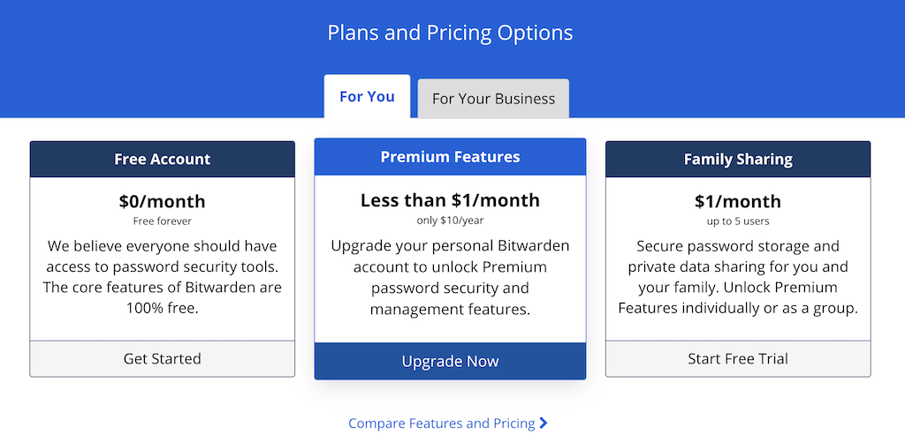
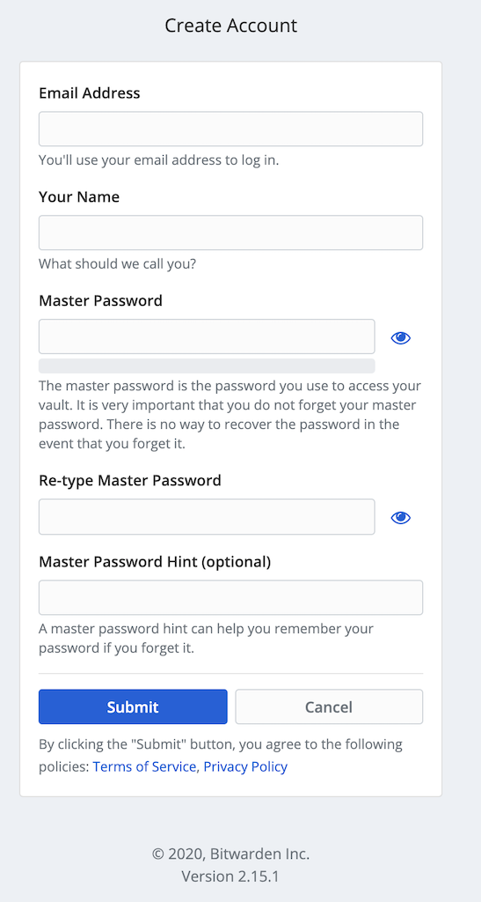
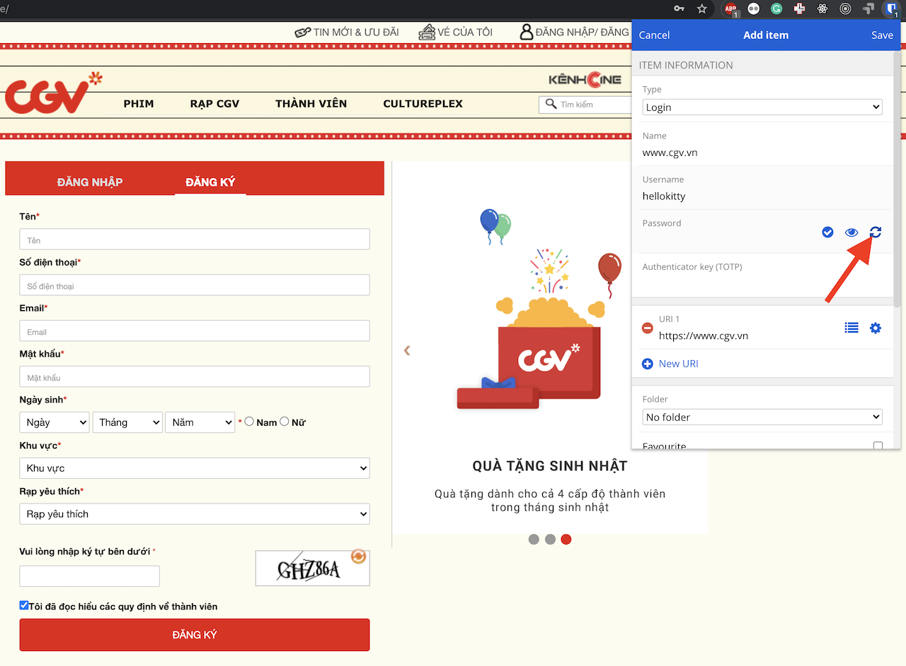
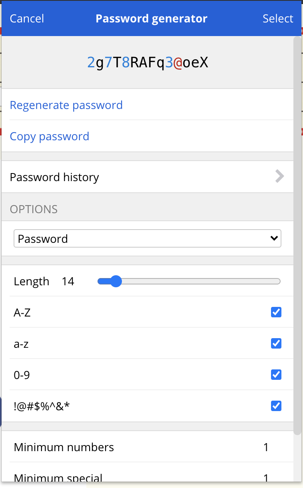
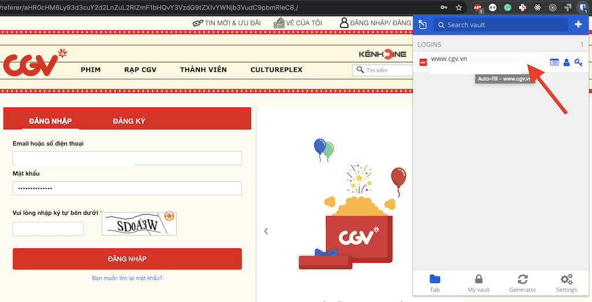

Đôi khi bạn lại thấy một dòng trạng thái "Bạn A bạn mình bị mất nick facebook, xin mọi người đừng chuyển tiền nếu nhận được tin nhắn", hay nhận được lời than thở "Mình mới bị mất nick instagram", hay một fanpage/ group bị bay màu do admin bị hack nick. Đó đều là những vụ tấn công, và phần nhiều trong số đó là các vụ tấn công liên quan đến việc mật khẩu bị đánh cắp. Trong bài viết này mình xin chia sẻ về tầm quan trọng của việc có mật khẩu an toàn và cách để chúng ta bảo vệ bản thân bằng cách cài đặt mật khẩu an toàn.

**_Bài viết này lấy cảm hứng từ buổi livestream [Hỏi đáp về sử dụng internet an toàn](https://vnhacker.blogspot.com/2020/07/reminder-ve-buoi-hoi-ap-su-dung.html). Mình rất khuyến khích các bạn dành thời gian xem livestream này (đã được ghi lại trên [youtube](https://www.youtube.com/watch?v=UGuKG4rMs8U)), thực sự rất hay và cung cấp rất nhiều thông tin chuyên sâu và bổ ích._**

Chúng ta hãy cùng nghe câu chuyện của anh K nhé.

**K là một nhân viên của một công ty tư vấn bất động sản. K có một email công ty để trao đổi với sếp và tư vấn khách hàng, một email cá nhân, một tài khoản facebook, một tài khoản ngân hàng và rất nhiều tài khoản trên các diễn đàn, dịch vụ khác. K sử dụng riêng một mật khẩu cho email công ty, còn lại tất cả các dịch vụ khác K đều để chung một mật khẩu mặc định.**

**Một ngày nọ, diễn đàn Hoa Phượng mà K tham gia bị hack, hacker lấy được toàn bộ mật khẩu của người dùng diễn đàn. K cũng là một nạn nhân. Kẻ tấn công sau khi có được mật khẩu của K thì tiến hành thử đăng nhập vào các dịch vụ khác như Facebook, Gmail, Internet Banking bằng mật khẩu của K tại diễn đàn Hoa Phượng. Thật may mắn cho tên hacker đó, K đặt mật khẩu các dịch vụ giống nhau, nên hắn đã truy cập được vào hầu như tất cả các dịch vụ K sử dụng.**

**Hắn vào được facebook giả danh K mượn tiền bạn bè K.**

**Hắn đăng nhập vào tài khoản ngân hàng của K, tiến hành chuyển khoản toàn bộ số tiền K tích cóp trong 3 năm trời (mã OTP có thể nhận qua email cá nhân).**

**Hắn tìm thấy địa chỉ email công ty của K nhưng không thể đăng nhập, nhưng có thể reset mật khẩu sử dụng email cá nhân của K. Không lâu sau, rất nhiều thông tin nhạy cảm về khách hàng và chiến lược bán hàng của công ty K đã bị bán cho công ty đối thủ, khiến công ty của K thiệt hại rất nhiều tiền, công ty đối thủ tiết lộ K chính là người đã làm lộ thông tin nhạy cảm và K đang đứng trước nguy cơ mất việc. Và tất cả bắt nguồn từ việc K đặt tất cả các mật khẩu giống nhau.**

Câu chuyện trên nghe có vẻ hơi đen tối và "chắc nó chừa mình ra". Nhưng thực sự kịch bản trên là hoàn toàn có thể xảy ra nếu chúng ta vẫn giữ cho mình một thói quen đặt mật khẩu không an toàn. Mật khẩu không an toàn là mật khẩu quá dễ đoán như tên tuổi `nguyenvank`, ngày sinh `01021997`, hay quá ngắn như `123456`, hay quá phổ biến như `password`, `iloveyou`... Đặc biệt đó là **sử dụng một mật khẩu cho tất cả các tài khoản khác nhau**. Hàng ngày chúng ta sử dụng hàng trăm dịch vụ trực tuyến, không thể biết khi nào một hệ thống gặp sự cố bị lộ mật khẩu. Hay khi nào chính chúng ta vô tình làm lộ ra mật khẩu của một dịch vụ nào đó. Và khi đó, hacker hoàn toàn có thể truy cập vào các tài khoản khác của bạn bằng cách thử với mật khẩu bị lộ, một viễn cảnh tương tự như K hoàn toàn có thể xảy đến với bạn (có thể ít đen tối hơn).

Lời khuyên đưa ra đó là bạn cần có một mật khẩu phức tạp, tốt nhất là **trên 12 kí tự trở lên**, bao gồm cả kí tự chữ, số và kí tự đặc biệt. Một tip để sinh ra mật khẩu an toàn đó là hãy nghĩ ra một câu thật dài và những cách mã hóa cho riêng mình. Ví dụ: `cuoituanthid1ch0iodaub@ygio`, hay `belen3bedima^~ug1ao`, hay `daylam0tcaimatkhauratdai!`. Và điều quan trọng nhất đó là **CÁC TÀI KHOẢN KHÁC NHAU PHẢI CÓ MẬT KHẨU KHÁC NHAU**. Nhưng đến đây, bạn đọc có thể sẽ thắc mắc: Tôi sử dụng 10 dịch vụ khác nhau, mỗi dịch vụ tôi lại mất công nghĩ ra một mật khẩu phức tạp, thì làm sao tôi có thể nhớ được hết? Thôi tôi đặt vài mật khẩu phức tạp cho các dịch vụ quan trọng như email, ngân hàng. Còn các dịch vụ không quan trọng lắm thì cứ để chung hết một mật khẩu đơn giản đi, đằng nào cũng "không quan trọng" mà. Nhưng, hãy xem lại câu chuyện của bạn K, bạn ý đã đặt mật khẩu quan trọng cho email công ty rồi, nhưng vẫn bị hack mất đó thôi. Nên việc suy nghĩ "tài khoản không quan trọng thì chung mật khẩu cũng được" là một suy nghĩ chúng ta nên thay đổi.

Một điểm cần lưu ý thêm đó là việc **an toàn sẽ có cái giá của nó, nó không miễn phí**. Ví dụ như cái cửa ra vào. Nếu muốn tiện lợi thì có thể không cần khóa, chỉ khép cửa vào thôi, rất tiện. Nhưng trộm có thể vào nhà bạn và khiêng hết đồ đạc đi. Ngược lại, nếu bạn muốn an toàn, bạn phải khóa trong, khóa ngoài, khóa trên, khóa dưới, khóa thêm cả vân tay. Như thế sẽ khiến trộm khó có thể vào nhà bạn được nhưng bạn lại đánh mất đi một chút tiện lợi.

Nhưng làm thế nào đặt được mật khẩu phức tạp, lại còn nhiều, nhưng vẫn có thể quản lý được chúng? Có phải đây chính là cái giá mà mình phải trả khi muốn an toàn không. Và đó là khi các phần mềm quản lý mật khẩu như một vị cứu tinh khiến cuộc sống dễ dàng hơn rất nhiều.

Phần mềm quản lý mật khẩu (QLMK - Password Manager) là phần mềm giúp người dùng tạo ra các mật khẩu an toàn, lưu trữ các mật khẩu đó (và có thể tự điền vào khi người dùng cần đăng nhập). Các phần mềm QLMK sử dụng công nghệ Vault để lưu trữ toàn bộ mật khẩu của người dùng dưới dạng mã hóa, chính bên cung cấp cũng không thể đọc được mật khẩu của bạn, chỉ có thể giải mã bằng **master password**. Phần mềm QLMK giúp việc đặt mật khẩu khác nhau cho các dịch vụ khác nhau bỗng trở nên dễ dàng. Phần mềm cũng giúp người dùng tạo ra các mật khẩu đủ phức tạp và an toàn, ta thậm chí còn không cần phải nhớ mật khẩu đó. Việc duy nhất và quan trọng nhất chúng ta cần làm đó là bảo vệ **master password**. Sử dụng các phần mềm QLMK còn giúp chúng ta phòng chống tấn công phishing (giả mạo trang đăng nhập), vì các phần mềm QLMK sẽ tự động điền vào form đăng nhập, nếu trang web không đúng, nó sẽ không tự điền, ta có thể nhận ra được mình đang bị lừa phishing. (Một điều buồn cười đó là chúng ta thường bị phishing vì chúng ta nhớ mật khẩu. Nếu chúng ta không nhớ mật khẩu, thì sẽ không bị phishing nữa).

Có rất nhiều phần mềm QLMK trả phí và miễn phí. Dĩ nhiên, tiền nào của nấy, các phần mềm trả phí thường sẽ có trải nghiệm người dùng tốt hơn các phần mềm miễn phí một chút. Trong bài viết này, mình xin giới thiệu với các bạn phần mềm [bitwarden](https://bitwarden.com/) vì các lý do:

- Nó có phiên bản miễn phí.
- Nó có phiên bản trả phí. Giá của phiên bản trả phí cũng rất hợp lý.
- [Open source](https://github.com/bitwarden)
- [Hỗ trợ tất cả các nền tảng phổ biến](https://bitwarden.com/download/). Có phần mềm trên Windows, Mac, Linux, có các extension cho tất cả các trình duyệt phổ biến, có app trên Android và iOS, có web app.
- Trải nghiệm người dùng (UX) tương đối tốt.

Download tại đây: https://bitwarden.com/download/
Đăng ký tài khoản miễn phí tại đây: https://vault.bitwarden.com/#/register

Vì Bitwarden vận hành với mô hình Freemium nên ta có thể yên tâm về việc sử dụng phiên bản miễn phí của nó. Bạn có thể trả tiền để sử dụng bản trả phí với nhiều tính năng bảo vệ hơn. Vì là mã nguồn mở nên việc phát hiện và cung cấp các bản vá lỗi nếu có cũng sẽ rất minh bạch và nhanh chóng. Bitwarden cung cấp phần mềm cho tất cả các nền tảng phổ biến khiến cho trải nghiệm của người dùng khi sử dụng nhiều thiết bị khá mượt.

Dưới đây là một vài hình ảnh khi sử dụng bitwarden:

Đăng ký https://vault.bitwarden.com/#/register

Tạo một mật khẩu an toàn mới và lưu vào Bitwarden Vault bằng Bitwarden Chrome Extension

Sinh ra mật khẩu an toàn

Tự động điền mật khẩu bằng Bitwarden Chrome Extension

Việc sử dụng Bitwarden là rất đơn giản và trực quan. Trên đây là các thao tác cơ bản với Bitwarden Chrome Extension. Bitwarden trên Windows, Mac, Linux, Android, iPhone cũng rất đơn giản và dễ dùng, mọi người hoàn toàn có thể cài đặt và làm quen nhanh chóng.

**Kết luận:** Chúng ta ngày càng sử dụng nhiều dịch vụ trực tuyến, kết nối với internet ngày càng nhiều hơn. Điều đó đồng nghĩa với việc chúng ta càng cần phải cẩn trọng hơn trong việc bảo vệ bản thân mình. Việc có các mật khẩu tốt là tiền đề cho việc sử dụng internet an toàn hơn. Khi đó, không những bảo vệ bản thân, mà bạn đang bảo vệ người thân, gia đình, công ty mình, và rộng ra là toàn xã hội.
